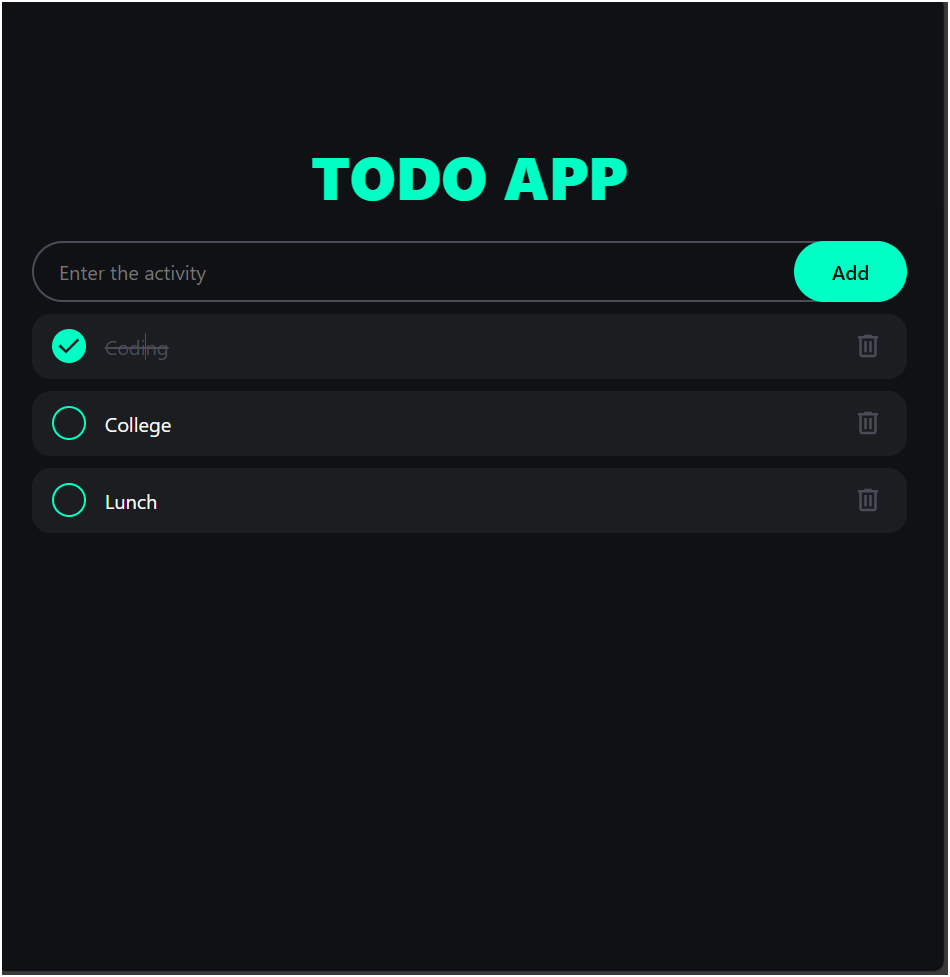

# 📝 To-Do List

A simple and interactive To-Do List application that helps you organize your daily tasks with ease.  
Built with **HTML, CSS, and JavaScript**.

---

## 🚀 Features
- ➕ Add new tasks
- ✅ Mark tasks as completed  
- ❌ Delete tasks  
- 💾 Saves tasks in local storage (persists even after refresh)  
- 📱 Responsive design (works on mobile & desktop)

---

## 📸 Screenshots


---

## 🛠️ Tech Stack
- HTML  
- CSS  
- JavaScript  

---

## ⚙️ Installation

1. Clone the repository:
   ```bash
   git clone https://github.com/Shiva-005/To-Do-list.git

2. Open the project folder:

    cd todo-list


3. Run the app by opening index.html in your browser.


📖 Usage

Enter your task in the input box.

Click Add or press Enter.

Manage tasks easily – mark them as done, or delete.
